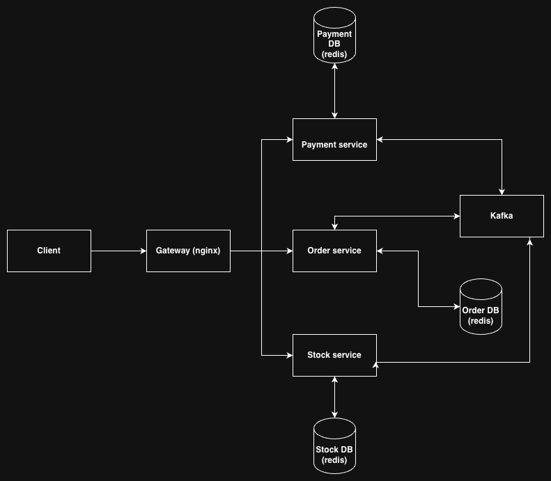

# Distributed Data Systems Project 

We implement a distributed webshop using microservices for order, payment, and stock. Each service has its own Redis database and the services communicate internally through Kafka. 

We have two versions of the checkout protocol:

- a 2PC-based version (branch: [2pc_dev]), where the order service coordinates a distributed prepare/commit/abort protocol.

- a Saga-based version (branch: [saga_dev] and [saga_replicas]), where the order service orchestrates local actions and compensating actions.

Both versions use the same external API structure, but differ in how they coordinate distributed state changes during checkout.

## 2PC 
Checkout is coordinated by the order service. It first asks the stock and payment services to prepare their part of the transaction, and only if all participants are ready, it sends the final commit decision. If any step fails, the transaction is aborted. This approach is designed to provide all-or-nothing distributed commit across services.

## Saga
The order service orchestrates checkout as a sequence of local transactions. Instead of waiting for a global commit decision, services perform their actions directly, and failures are handled through compensating actions such as releasing stock or refunding payment.

## Project structure

* `env`
    Folder containing the Redis env variables for the docker-compose deployment
    
* `helm-config` 
   Helm chart values for Redis and ingress-nginx
        
* `k8s`
    Folder containing the kubernetes deployments, apps and services for the ingress, order, payment and stock services.
    
* `order`
    Folder containing order application logic, transaction orchestration logic, lock management, Kafka request/reply handling, and Dockerfile. 
    
* `payment`
    Folder containing the payment application logic, Kafka worker for payment commands, lock management, and Dockerfile.

* `stock`
    Folder containing the stock application logic, Kafka consumer/dispatcher for stock commands, lock management, and Dockerfile.

* `test`
    Folder containing some basic correctness tests for the entire system. 

## Deployment :

#### docker-compose (local development)

For local development and testing run `docker-compose up --build` in the base folder.
This starts the gateway, all three services, their Redis instances, Kafka, ZooKeeper, topic setup, and the watchdog container.

***Requirements:*** You need to have docker and docker-compose installed on your machine. 

## Fault Tolerance

We include a watchdog container that monitors the service and database containers and restarts them if they crash. This is useful during fault-tolerance experiments and test scenarios where containers are intentionally killed during checkout.

## Contributions

Please read the contributions.txt file for the division of work across team members.

# Distributed Data Systems Project 

We implement a distributed webshop using microservices for order, payment, and stock. Each service has its own Redis database and the services communicate internally through Kafka. 

We have two versions of the checkout protocol:

- a 2PC-based version (branch: [2pc_dev]), where the order service coordinates a distributed prepare/commit/abort protocol.

- a Saga-based version (branch: [saga_dev] and [saga_replicas]), where the order service orchestrates local actions and compensating actions.

Both versions use the same external API structure, but differ in how they coordinate distributed state changes during checkout.

## 2PC 
Checkout is coordinated by the order service. It first asks the stock and payment services to prepare their part of the transaction, and only if all participants are ready, it sends the final commit decision. If any step fails, the transaction is aborted. This approach is designed to provide all-or-nothing distributed commit across services.

## Saga
The order service orchestrates checkout as a sequence of local transactions. Instead of waiting for a global commit decision, services perform their actions directly, and failures are handled through compensating actions such as releasing stock or refunding payment.

## Project structure

* `env`
    Folder containing the Redis env variables for the docker-compose deployment
    
* `helm-config` 
   Helm chart values for Redis and ingress-nginx
        
* `k8s`
    Folder containing the kubernetes deployments, apps and services for the ingress, order, payment and stock services.
    
* `order`
    Folder containing order application logic, transaction orchestration logic, lock management, Kafka request/reply handling, and Dockerfile. 
    
* `payment`
    Folder containing the payment application logic, Kafka worker for payment commands, lock management, and Dockerfile.

* `stock`
    Folder containing the stock application logic, Kafka consumer/dispatcher for stock commands, lock management, and Dockerfile.

* `test`
    Folder containing some basic correctness tests for the entire system. 

## Deployment :

#### docker-compose (local development)

For local development and testing run `docker-compose up --build` in the base folder.
This starts the gateway, all three services, their Redis instances, Kafka, ZooKeeper, topic setup, and the watchdog container.

***Requirements:*** You need to have docker and docker-compose installed on your machine. 

## Fault Tolerance

We include a watchdog container that monitors the service and database containers and restarts them if they crash. This is useful during fault-tolerance experiments and test scenarios where containers are intentionally killed during checkout.

