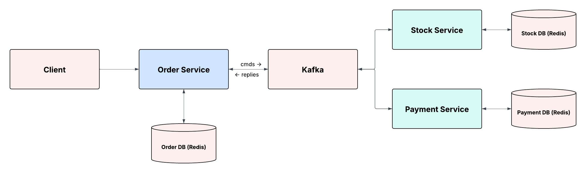
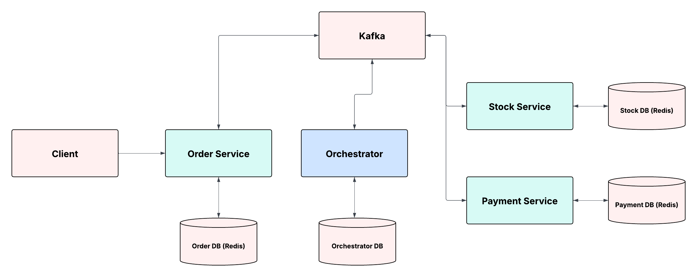

# Distributed Data Systems Project

We implement a distributed webshop using microservices for order, payment, and stock. Each service has its own Redis database and the services communicate internally through Kafka.

We have four variants across two protocols and two architectures:

| Branch | Protocol | Architecture |
|---|---|---|
| `2pc_normal_scalability` | 2PC | Order service coordinates directly |
| `saga_high_load_fix` | Saga | Order service coordinates directly |
| `2pc_orchestrator_scalability` | 2PC | Dedicated orchestrator service |
| `saga_orchestrator_sentinel` | Saga | Dedicated orchestrator service |

## 2PC

Checkout runs as a two-phase commit. In the prepare phase, stock locks the required units and payment locks the required credit. Only once both confirm does the coordinator send commits. If any participant fails to prepare, both are aborted. The commit phase retries indefinitely — once entered it is irrevocable. State is checkpointed to Redis at each step so a crash mid-protocol can be recovered on restart.

## Saga

Checkout is a sequence of local transactions with compensating actions on failure. Stock is reserved first, then payment is charged. If payment fails, reserved stock is released. If a crash occurs mid-saga, recovery forward-completes or compensates depending on how far the saga had progressed.


*Without orchestrator*
## Orchestrator

In the non-orchestrator branches the order service runs the full protocol itself. In the orchestrator branches a dedicated service handles all coordination — the order service forwards the checkout request over Kafka and waits for the outcome.


*With orchestrator*
## Project structure

* `env` — Redis env variables for docker-compose deployment
* `helm-config` — Helm chart values for Redis and ingress-nginx
* `k8s` — Kubernetes deployments for ingress, order, payment, and stock
* `orchestrator` — Orchestrator service (orchestrator branches only)
* `order` — Order application logic, checkout coordination, lock management, Kafka request/reply
* `payment` — Payment application logic, Kafka worker, lock management
* `stock` — Stock application logic, Kafka consumer/dispatcher, lock management
* `test` — Correctness, concurrency, and fault-tolerance tests

## Deployment

```bash
# Default config
docker compose up --build

# Medium config
docker compose -f docker-compose-medium.yml up --build -d

# Large config 
docker compose -f docker-compose-large.yml up --build -d

# Tear down
docker compose down -v
```


**Requirements:** Docker and docker-compose must be installed.

## Fault Tolerance

A watchdog container monitors all service and database containers and restarts them on crash. Used during fault-tolerance experiments where containers are intentionally killed mid-checkout.

## Scalability

Files 
`docker-compose.yml`
`docker-compose-medium.yml` 
`docker-compose-large.yml`

## Testing

### Unit / integration tests

```bash
pip install aiohttp
python test/test_microservices.py
```

### Fault tolerance test

```bash
pip install aiohttp
python test/fault_tolerance_test.py
```

Populates the system, fires concurrent checkouts, and verifies consistency at the end.

## Benchmark (wdm-project-benchmark)

Clone the benchmark repo:
```bash
git clone https://github.com/delftdata/wdm-project-benchmark
cd wdm-project-benchmark
pip install -r requirements.txt
```

Edit `urls.json` to point at your gateway (default is `localhost:8000`).

### Consistency test

```bash
cd consistency-test
python run_consistency_test.py
```

### Stress test


```bash
cd stress-test
python init_orders.py         
locust -f locustfile.py --host="http://localhost:8000"
```

Open `http://localhost:8089` for the Locust UI. 
